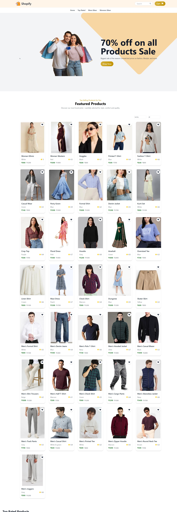
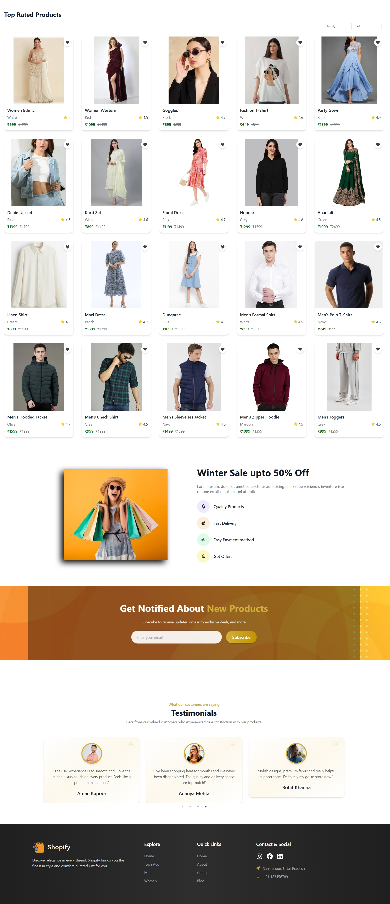
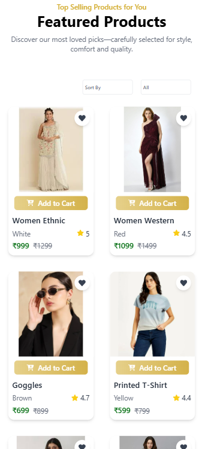
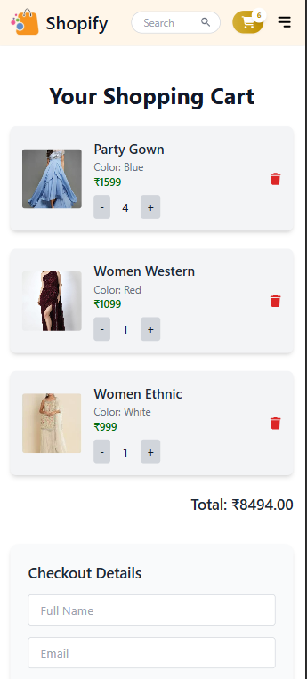
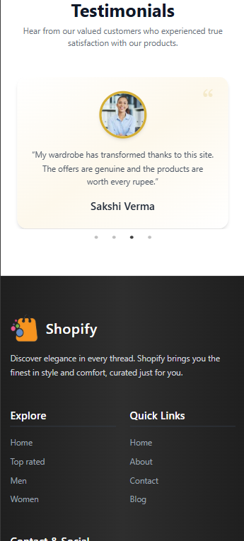
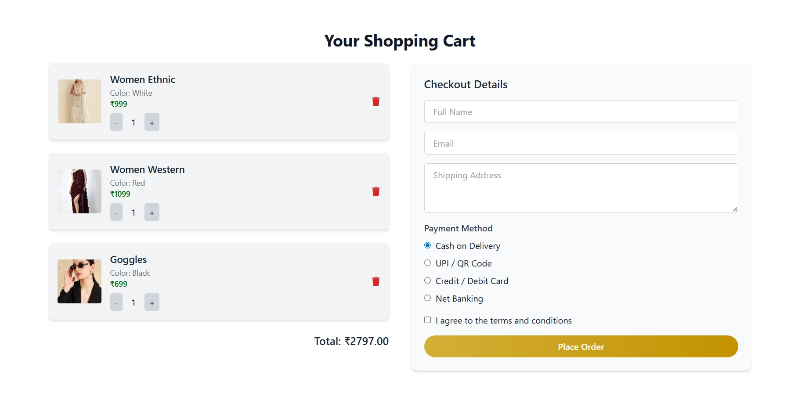
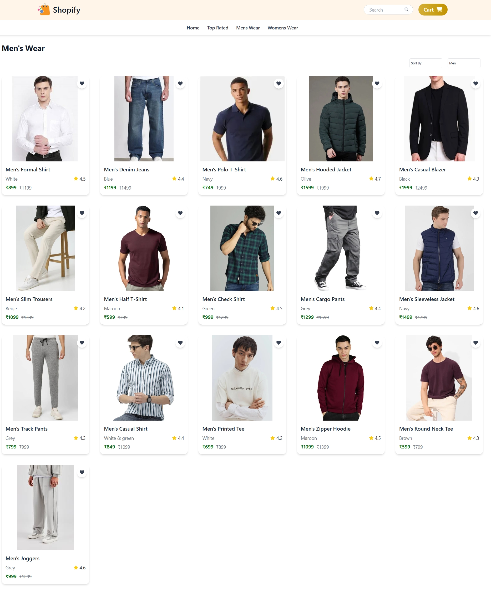
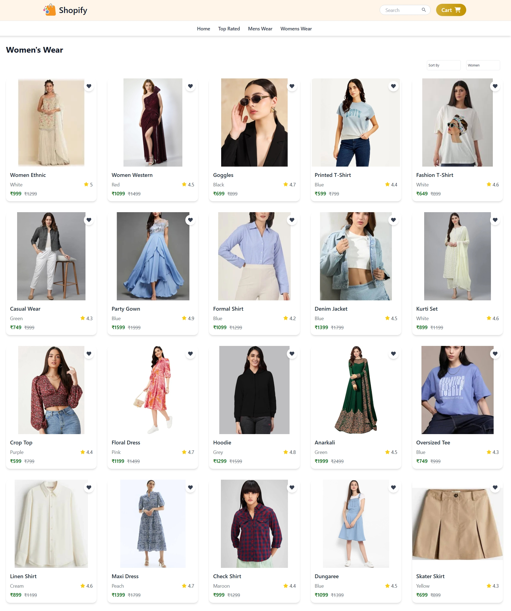

# E‑Commerce UI 🛍️

A responsive, modern e‑commerce user‑interface built with **React 18, Vite, and Tailwind CSS**. Browse products, filter by category, add items to cart, and experience smooth UX across devices.

---

## ✨ Features

| Category      | Highlights                                                                                                                   |
| ------------- | ---------------------------------------------------------------------------------------------------------------------------- |
| **UI/UX**     | Hero banner, product grids, mobile‑first responsive design                               |
| **React**     | Functional components, Context API global state, hooks (`useState`, `useEffect`, `useContext`), conditional & list rendering |
| **Tailwind**  | Utility‑first styling, custom breakpoints, hover/transition effects, reusable component styles                               |
| **Cart**      | Add/remove items, quantity control, cart total calculation                                                                   |
| **Filtering** | Category & rating filter bar                                                                    |
| **Build**     | Vite hot‑reload dev server, optimized production bundle                                                                      |

---

## 🏁 Quick Start

```bash
# 1. Clone the repo
$ git clone https://github.com/vanshsharma001/Modern-E-Commerce-Platform.git
$ cd Modern-E-Commerce-Platform

# 2. Install dependencies
$ npm install   # or pnpm install / yarn

# 3. Start the dev server
$ npm run dev
# ➜ open http://localhost:5173 in your browser
```

### Production Build

```bash
npm run build    # Generates dist/ with optimized assets
npm run preview  # Serves the production build locally
```

---

## 📂 Project Structure

```
src/
├─ assets/           # Images & static assets
├─ components/       # Reusable UI blocks
│  ├─ Navbar/
│  ├─ Hero/
│  ├─ Products/
│  └─ ...
├─ context/          # Global Context provider
├─ pages/            # Route‑level pages (MensWear, WomensWear, CartPage…)
├─ data/             # Static JS/JSON data
├─ App.jsx           # Root component & routes
└─ main.jsx          # Entry point (ReactDOM render)
```

---

## 🛠️ Tech Stack

* **React 18**  |  JSX, hooks, Context API
* **Vite**  |  Lightning‑fast bundler & dev server
* **Tailwind CSS 3**  |  Utility‑first styling
* **ESLint + Prettier** (recommended) for code quality

---

## 🚀 Deployment

The app works out‑of‑the‑box on Static Hosts such as **Vercel**, **Netlify**, **GitHub Pages** (via gh‑pages).

1. Build the project: `npm run build`
2. Deploy the `dist/` folder per platform instructions.

---

## 👥 Contributing

1. Fork the repository
2. Create a feature branch: `git checkout -b feat/amazing‑feature`
3. Commit your changes: `git commit -m "feat: add amazing‑feature"`
4. Push to the branch: `git push origin feat/amazing‑feature`
5. Open a Pull Request

Please follow the [Conventional Commits](https://www.conventionalcommits.org/) spec and ensure `npm run lint` passes.

---

## 📄 License

Distributed under the **MIT License**. See `LICENSE` for more information.

---

## 🙏 Acknowledgements

* Product imagery: [Unsplash](https://unsplash.com/) & [Freepik](https://www.freepik.com/)
* Icon set: [Heroicons](https://heroicons.com/)

---
Screenshots











> Built with ❤️ by Vansh – Happy coding!
